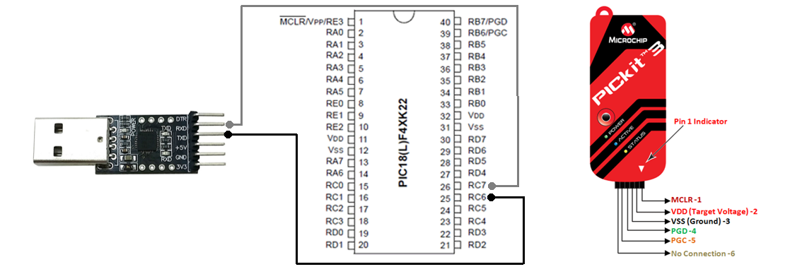

# Lab04: Comunicación UART en PIC18F45K22

## Integrantes

[Juan Esteban Monroy Moya - 136851](https://github.com/Juanes20feb)

[Shirley Katherin Bohorquez Gil - 131164](https://github.com/Shirleyb0440)

[Alison Daniela Vera Rocha - 131212](https://github.com/Alisondaniela-bot)

## Documentación

### Introducción

En este laboratorio se implementa la comunicación serial UART utilizando el microcontrolador PIC18F45K22 en modo asíncrono. El objetivo es establecer una conexión entre el PIC y una computadora a través de un módulo USB-UART, permitiendo enviar y recibir datos en tiempo real. Esta práctica permite comprender la configuración del módulo EUSART y su utilidad en sistemas embebidos para tareas de monitoreo, control y depuración.

## Implmentación

## Preguntas

1. ¿Para qué sirve la UART en un microcontrolador como el PIC18F45K22?

RTA: La UART (o EUSART en el PIC18F45K22) se utiliza para enviar y recibir datos de forma serial, lo que la convierte en un método muy popular para conectar el microcontrolador con otros dispositivos, como computadoras, sensores o módulos Bluetooth y WiFi, entre otros.

2. ¿Qué tipo de aplicaciones o implementaciones se pueden hacer con la UART?

RTA: Con la UART se pueden crear aplicaciones, tales como: Comunicación entre microcontroladores, conexión con módulos inalámbricos como Bluetooth, GSM o WiFi, monitoreo de sensores desde la computadora, enviar comandos desde la PC al microcontrolador y registrar datos en tiempo real.

3. ¿Cuál es la diferencia entre una comunicación serial síncrona y una asíncrona como la UART?

RTA: En la comunicación serial síncrona, los dispositivos comparten una señal de reloj que mantiene los datos sincronizados. En cambio, en la comunicación asíncrona (como la UART), no hay una señal de reloj común: cada dispositivo necesita estar configurado con la misma velocidad de transmisión (baud rate) para poder entenderse y sincronizarse bien.

4. ¿Qué registros del PIC18F45K22 se usan para transmitir y recibir datos con EUSART?

RTA: Para transmitir, se usa el registro TXREG, donde se escribe el dato que se desea enviar y para recibir, se usa el registro RCREG, desde donde se lee el dato recibido. Además, se utilizan banderas como TXIF (transmisión lista) y RCIF (dato recibido) para controlar el flujo de datos.